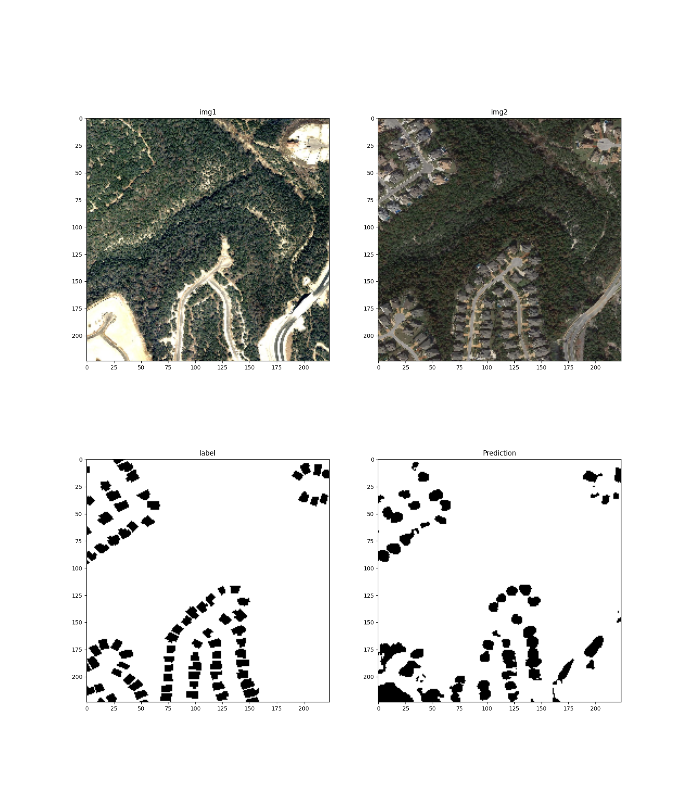

# Fully convolutional siamese networks for change detection

This is an implementation of the fully convolutional siamese network architectures for change detection between two images.
This model implemented here was proposed in [https://arxiv.org/pdf/1810.08462v1](https://arxiv.org/pdf/1810.08462v1). 
Both inputs are encoded using the same encoder. The difference between the results of the encoded layers is calculated and fed to the decoder. The result is a 2D mask of the same size as the input images.

## Install packages
```bash
pip install -r requirements.txt
```

## Train model

The [model](./siamese_diff_model.py) was trained using the [Levir-CD dataset](http://chenhao.in/LEVIR/).
You can use the jupyter notebook [train_fc_siam_diff.ipynb](train_fc_siam_diff.ipynb) to retrain the model. 

**Note the [unet_diff.py](./unet_diff.py) is deprecated!**
## Results
The trained model weights can be found [here](./model.weights.h5).
Below is an example of the mask produce by the FC_siamese_diff.
Top are input image, bottom left is label and bottom right is the mask computed by the model.

